# Global Happiness Report Analysis

## Project Overview

The Global Happiness Report Analysis project is a Python-based data analysis and visualization project developed using Jupyter Notebook. The project analyzes the World Happiness Report datasets from 2015 to 2019 to identify factors affecting happiness across different countries.

The project demonstrates data cleaning, statistical analysis, data visualization, and machine learning techniques using Python libraries.

---

## Dataset

The project uses the following World Happiness Report datasets:

- 2015.csv
- 2016.csv
- 2017.csv
- 2018.csv
- 2019.csv

The datasets contain information related to:

- Country
- Happiness Score
- GDP per Capita
- Family/Social Support
- Health/Life Expectancy
- Freedom
- Generosity
- Trust/Corruption
- Year

---

## Features

### Data Loading

- Load multiple CSV files
- Combine datasets into a single DataFrame
- Display dataset information

### Data Cleaning

- Check missing values
- Handle missing values
- Check duplicate records
- Remove duplicate records

### Statistical Analysis

- Mean
- Median
- Mode
- Standard Deviation
- Variance
- Correlation Matrix

### Country Analysis

- Search Country
- Compare Two Countries
- Top 10 Happiest Countries
- Bottom 10 Happiest Countries

### Data Visualization

- Correlation Heatmap
- Top 10 Happiest Countries Bar Chart
- Bottom 10 Happiest Countries Bar Chart
- Happiness Score Histogram
- GDP vs Happiness Scatter Plot
- Freedom vs Happiness Scatter Plot
- Life Expectancy vs Happiness Scatter Plot
- Box Plot
- Pie Chart
- Year-wise Happiness Trend

### File Export

- Save Cleaned Dataset as CSV
- Save Cleaned Dataset as Excel
- Save Graphs as PNG Images

---

## Project Structure

```text
Final_Project/

│
├── 2015.csv
├── 2016.csv
├── 2017.csv
├── 2018.csv
├── 2019.csv
│
├── Graphs/
│   ├── Heatmap.png
│   ├── Top10_Happiest_Countries.png
│   ├── Bottom10_Happiest_Countries.png
│   ├── Histogram.png
│   ├── GDP_vs_Happiness.png
│   ├── Freedom_vs_Happiness.png
│   ├── LifeExpectancy_vs_Happiness.png
│   ├── BoxPlot.png
│   ├── PieChart.png
│   └── Average_Happiness_Score_by_Year.png
│
├── Cleaned_Happiness_Report.csv
├── Cleaned_Happiness_Report.xlsx
│
└── Final_Project.ipynb
```
---
# Output Screenshots

### Output 1

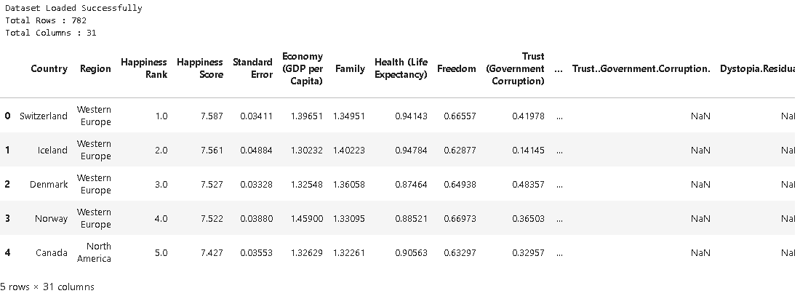

### Output 2

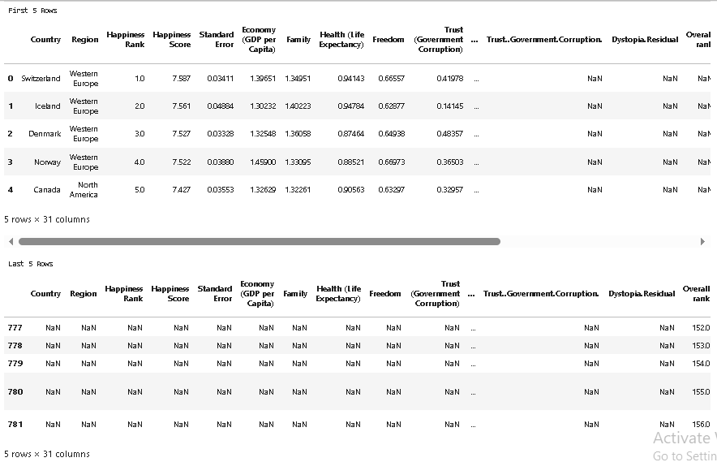

### Output 3

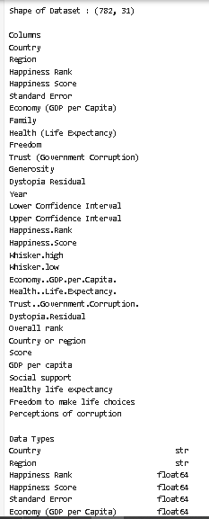

### Output 4

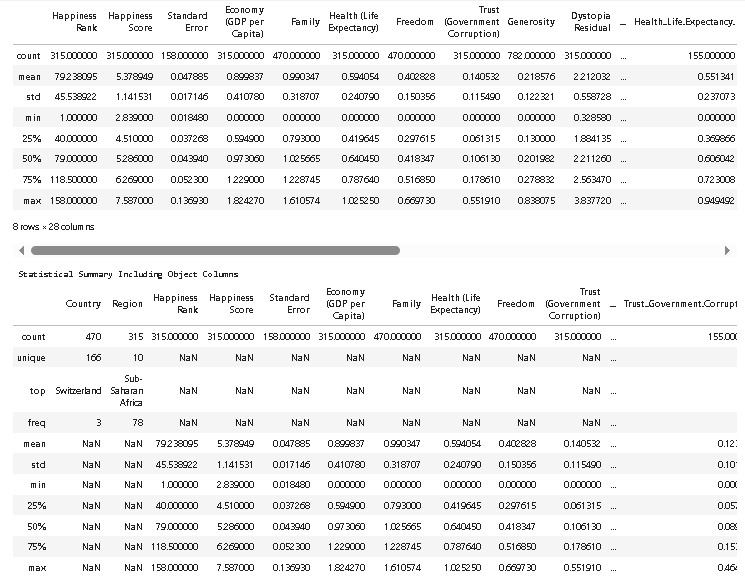

### Output 5

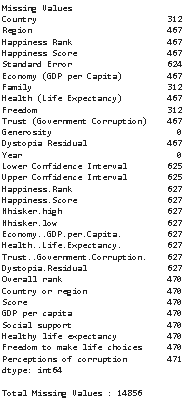

### Output 6

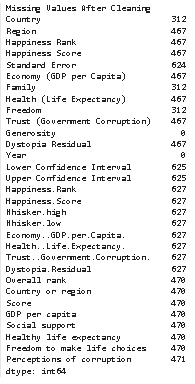

### Output 7

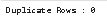

### Output 8

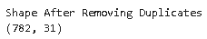

### Output 9

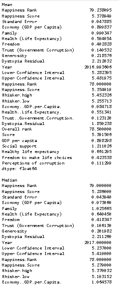

### Output 10

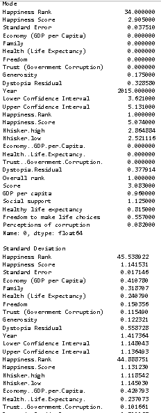

### Output 11

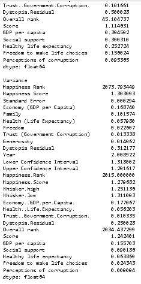

### Output 12

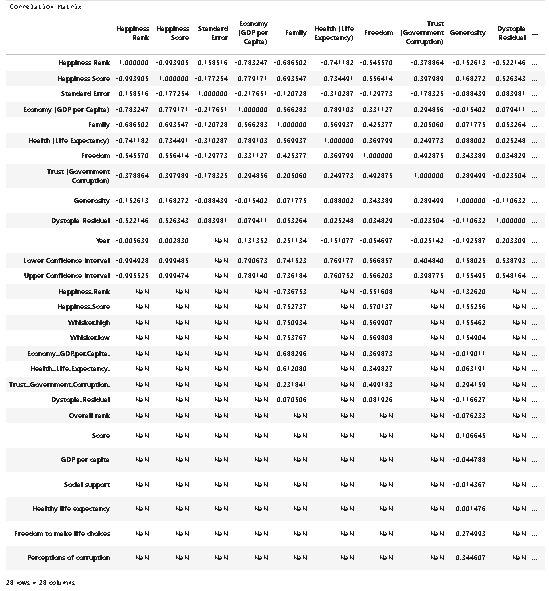

### Output 13


### Output 14

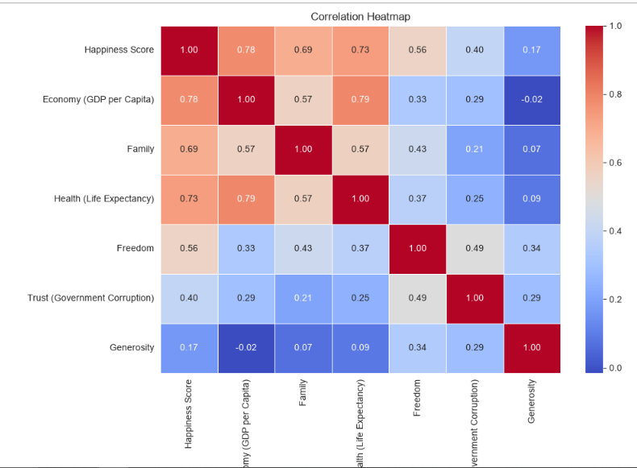

### Output 15

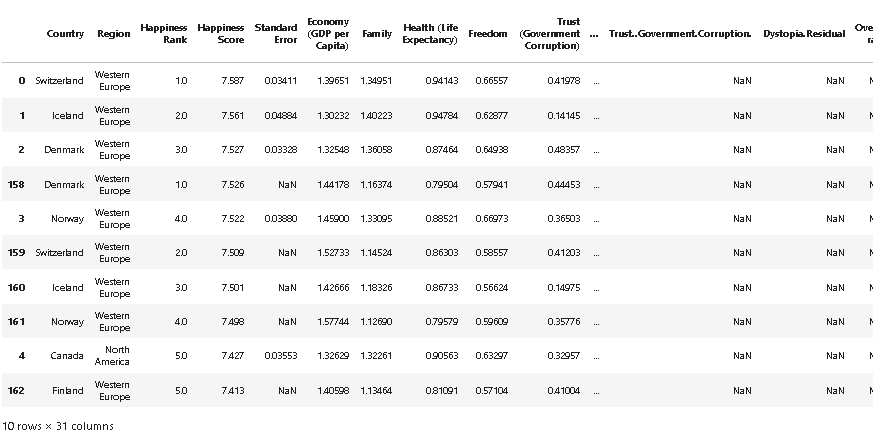

### Output 16

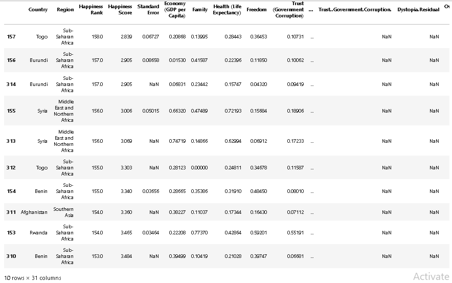

### Output 17

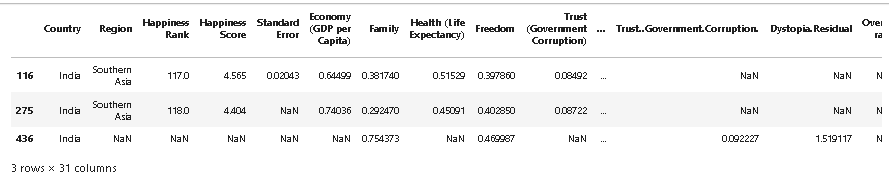

### Output 18

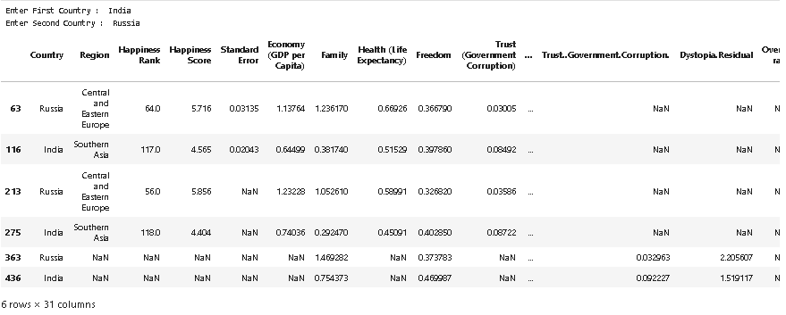

### Output 19

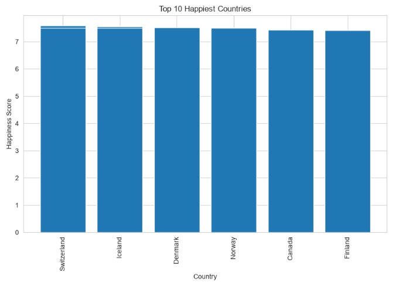

### Output 20

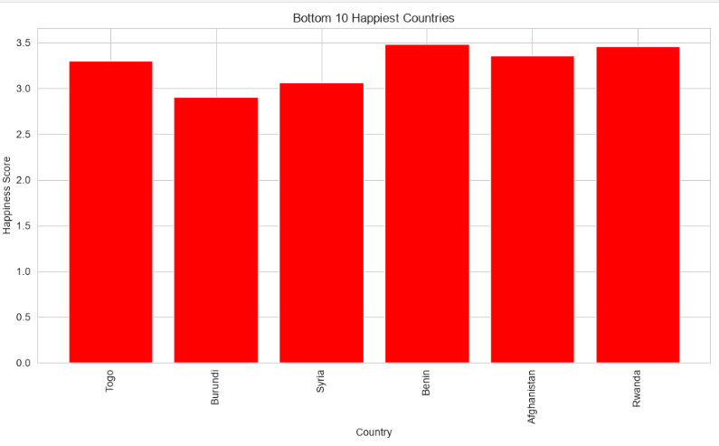

### Output 21

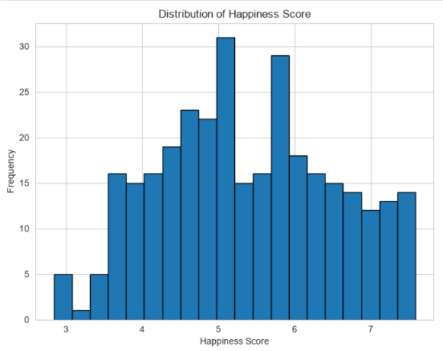

### Output 22

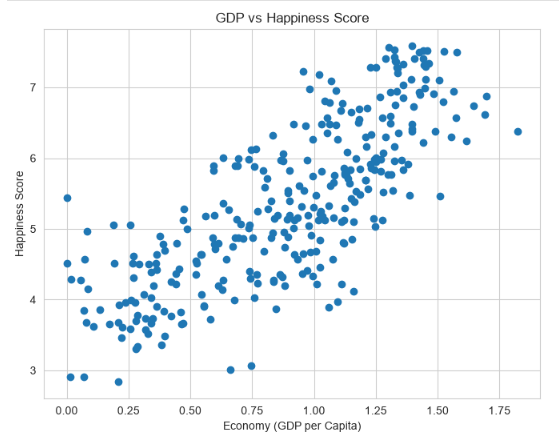

### Output 23

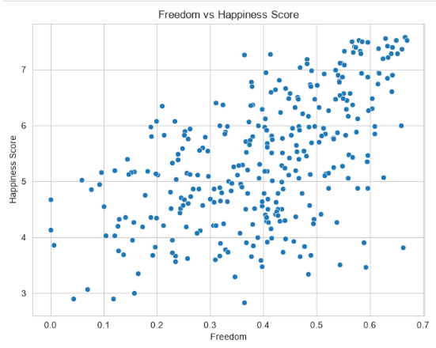

### Output 24

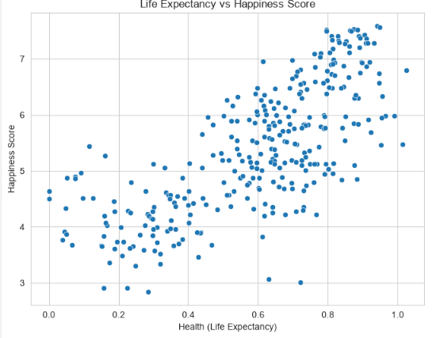

### Output 25

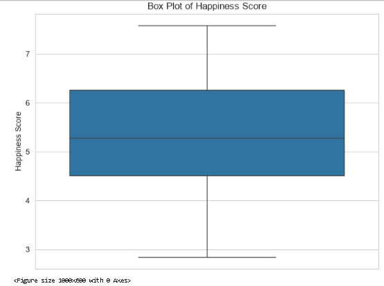

### Output 26

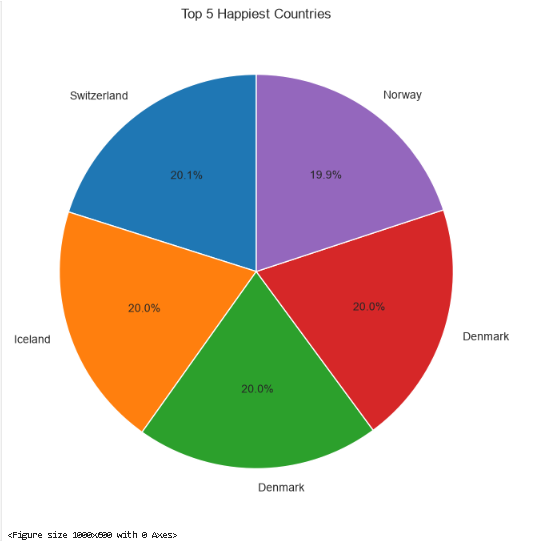

### Output 27

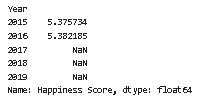

### Output 28

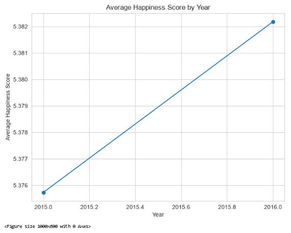

### Output 29

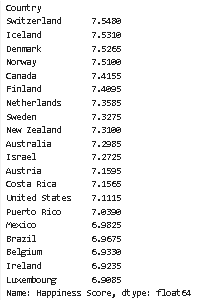

### Output 30

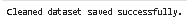

---

## 🎥 Project Demo Video

Watch the complete project demonstration here:

[▶ Watch Demo Video](https://drive.google.com/file/d/1wDq5vrSqPXqrSkUraquRwhPMNmfdmz3M/view)

---

## Author

**Sarth Thakar**
